<div align="center">

<a href="https://anirbanchatterjee.vercel.app">
  
</a>

# Anirban Chatterjee

**Full-Stack Software Engineer & CS Undergraduate**  
*EVM Protocols · Real-Time Computer Vision Inference · Scalable Distributed Backends*

`📍 Roorkee & Kolkata, India` &nbsp;•&nbsp; `🎓 Quantum University (CGPA 8.01 / 10.0)` &nbsp;•&nbsp; `🟢 Open to SDE Internships`

<br>

<p align="center">
  <a href="https://anirbanchatterjee.vercel.app"></a>&nbsp;
  <a href="https://github.com/Anirban4ru"></a>&nbsp;
  <a href="https://www.linkedin.com/in/anirban4ru"></a>&nbsp;
  <a href="https://calendly.com/anirban4ru/30min"></a>&nbsp;
  <a href="mailto:anirban4ru@gmail.com"></a>&nbsp;
  <a href="https://anirbanchatterjee.vercel.app/Anirban_Resume.pdf"></a>
</p>

</div>

<br>

---

## ⚡ Executive Overview

I am a **Full-Stack Software Engineer** and Computer Science undergraduate with proven end-to-end ownership across the stack — from **EVM smart contract architecture** to **real-time computer-vision inference** and **production frontend delivery**. 

I have independently architected and shipped two flagship engineering builds:
1. **[MediTrace](https://github.com/Anirban4ru/MediTrace)**: A decentralized pharmaceutical cold-chain provenance network on **Arbitrum Sepolia L2**, featuring cryptographic domain whitelisting and sub-second off-chain event indexers.
2. **[Nourish](https://github.com/Anirban4ru/DietarySystemApp)**: A mobile dietary analytics platform integrating custom-trained **YOLOv8** computer-vision object detection with an **NSGA-II multi-objective genetic algorithm** in FastAPI (co-authored in academic research).

My industry background includes engineering automated Python ETL pipelines and predictive commodity pricing models at **YuvaIntern**, as well as shipping 3 production-ready, accessible web applications within 4-week Agile sprints at **CodSoft**.

<br>

<table>
<tr>
<td width="25%" align="center">
<h3>🎯 Core Focus</h3>
<p>Full-Stack Systems<br>EVM L2 Smart Contracts<br>Applied CV & Genetic Opt</p>
</td>
<td width="25%" align="center">
<h3>🎓 Academic Standing</h3>
<p><b>B.Tech CSE Core</b><br>Minor in Data Analytics<br><b>CGPA: 8.01 / 10.0</b> (Merit Scholar)</p>
</td>
<td width="25%" align="center">
<h3>💼 Industry Experience</h3>
<p>Data Science Analyst @ <b>YuvaIntern</b><br>Full Stack Intern @ <b>CodSoft</b><br>Agile Sprints & Production APIs</p>
</td>
<td width="25%" align="center">
<h3>🔬 Research & Leadership</h3>
<p>Co-Author: <i>Intelligent Dietary Systems</i><br>Vice President: <i>Q Encore Club</i><br>Student Council Member</p>
</td>
</tr>
</table>

<br>

---

## 🛠️ Technical Arsenal

<div align="center">

### 💻 Languages
<a href="https://skillicons.dev">
  
</a>

<br>

### 🌐 Frontend & Mobile Architecture
<a href="https://skillicons.dev">
  
</a>

<br>

### ⚙️ Backend, Web3 & Cloud Systems
<a href="https://skillicons.dev">
  
</a>

<br>

### 🧰 DevOps, Data Science & Developer Tools
<a href="https://skillicons.dev">
  
</a>

</div>

<br>

<details open>
<summary><b>🔍 Detailed Technical Matrix (Click to expand / collapse)</b></summary>

| Domain | Technologies & Frameworks |
| :--- | :--- |
| **Languages** | Python, Java, JavaScript (ES6+), TypeScript, Solidity, Dart, SQL, C++, C, HTML5, CSS3 |
| **Frontend & Mobile** | React.js, Next.js (App Router), React Native, Tailwind CSS, Bootstrap, Three.js, Lucide Icons |
| **Backend & Microservices** | Node.js, FastAPI, Express.js, RESTful APIs, WebSockets, Asyncio, Event-Driven Architecture |
| **Web3 & Blockchain** | Solidity, Hardhat, Ethers.js, Arbitrum Sepolia L2, Web3.py, Smart Contract Security, Off-Chain Indexers |
| **Data Science & ML** | OpenCV.js, YOLOv8, Scikit-learn, XGBoost, CNNs, NSGA-II Genetic Algorithm, Pandas, NumPy, EDA |
| **Databases & Storage** | Supabase, PostgreSQL, MySQL, Firebase, Schema Normalization, Relational Modeling |
| **DevOps & Tooling** | Git, GitHub, Docker, VS Code, Postman, Vite, Linux / Bash, ESLint, Vercel |

</details>

<br>

---

## 🚀 Featured Technical Projects

<table>
<tr>
<td width="50%" valign="top">

### 🔗 [MediTrace](https://github.com/Anirban4ru/MediTrace) — Decentralized Cold-Chain Supply Protocol


A decentralized pharmaceutical traceability platform integrating EVM smart contracts with simulated IoT cold-chain telemetry (2°C–8°C), designed to eliminate counterfeit drugs.

- **Cryptographic Security**: Engineered host-domain whitelisting on the Pharmacy Inspector Terminal, neutralizing DNS spoofing, phishing, and lookalike domain vectors.
- **Event-Driven Indexer**: Built an off-chain blockchain indexer on Arbitrum Sepolia L2 firing sub-second asynchronous webhooks for immediate anomaly alerts.
- **Computer Vision Verification**: Embedded OpenCV.js client-side verification routines for batch validation.

**Stack:** `Next.js` `Solidity` `Arbitrum Sepolia L2` `Node.js` `OpenCV.js` `Supabase` `Tailwind CSS`

🔗 **[Live Demo](https://meditraceorg.vercel.app/)** · 💻 **[GitHub Repository](https://github.com/Anirban4ru/MediTrace)**

</td>
<td width="50%" valign="top">

### 🥗 [Nourish](https://github.com/Anirban4ru/DietarySystemApp) — Intelligent Dietary Systems


Full-stack mobile dietary analytics app integrating real-time camera computer-vision inference with algorithmic meal synthesis, co-authored in academic research.

- **Real-Time CV Inference**: Deployed custom-trained YOLOv8 object-detection models for classifying food items directly from live mobile camera feeds with high precision.
- **Multi-Objective Genetic Algorithm**: Implemented an NSGA-II genetic optimization algorithm in Python/FastAPI to balance complex caloric and micro/macro-nutrient constraints.
- **Cross-Platform Mobile**: Built with React Native & TypeScript with Supabase backend persistence.

**Stack:** `React Native` `TypeScript` `YOLOv8` `NSGA-II` `FastAPI` `Python` `Supabase`

💻 **[GitHub Repository](https://github.com/Anirban4ru/DietarySystemApp)** · 📱 **[Download APK (v3.1)](https://github.com/Anirban4ru/DietarySystemApp/releases/latest)**

</td>
</tr>
<tr>
<td width="50%" valign="top">

### 💳 [Crypto Borderless Pay](https://github.com/Anirban4ru/crypto-borderless-pay)


Frictionless cross-border payment platform enabling instantaneous multi-token transfers with minimal gas overhead and verifiable settlement.

- Engineered non-custodial wallet handshakes, gas-optimized Solidity settlement routines, and live on-chain status tracking.
- Interactive transaction lifecycle telemetry across testnets.

**Stack:** `React` `Solidity` `Ethers.js` `Web3.py` `Hardhat`

💻 **[GitHub Repository](https://github.com/Anirban4ru/crypto-borderless-pay)**

</td>
<td width="50%" valign="top">

### ⚡ [DupeCleaner-Pro](https://github.com/Anirban4ru/DupeCleaner-Pro)


High-performance disk optimization utility for identifying duplicate files via memory-efficient cryptographic hash parsing.

- Engineered a chunked stream-reading architecture that eliminates memory bottlenecks when indexing large directory structures.
- Fast multi-threaded traversal with real-time deduplication reporting.

**Stack:** `Node.js` `TypeScript` `File System API` `Streams`

💻 **[GitHub Repository](https://github.com/Anirban4ru/DupeCleaner-Pro)**

</td>
</tr>
</table>

<br>

---

## 💼 Industry Experience

```
YuvaIntern — Junior Data Science Analyst (Agribusiness)
[ Remote | 08/2026 – 09/2026 ]
├── Analysed agribusiness datasets via Exploratory Data Analysis (EDA) and statistical modelling.
├── Engineered automated Python data pipelines for cleaning and normalization, eliminating anomalies.
└── Built predictive regression models forecasting commodity price movements for operational decisions.

CodSoft — Full Stack Development Intern
[ Remote | 06/2024 – 07/2024 ]
├── Shipped 3 production-ready, responsive web applications using TypeScript, React.js, and CSS in 4-week Agile sprints.
├── Optimized UI component architecture, resolving Cumulative Layout Shift (CLS) and cross-browser rendering quirks.
└── Architected end-to-end client-server integrations connecting frontends to RESTful API endpoints for scalable data exchange.
```

<br>

---

## 🎓 Academic Foundation

- **Quantum University, Roorkee, Uttarakhand**
  - **B.Tech, Computer Science & Engineering (CSE Core)** · Minor in Data Analytics
  - Expected Graduation: **June 2028** | Cumulative GPA: **8.01 / 10.0** (*Merit Scholar*)
  - **Core Coursework:** Data Structures & Algorithms (DSA), Database Management Systems (DBMS), Machine Learning, Object-Oriented Programming (Java), Computer Networks

<br>

---

## 📊 GitHub Analytics & Activity

<div align="center">

<!-- Contribution Snake Animation -->


<br><br>

<table>
<tr>
<td width="50%" align="center">
  
</td>
<td width="50%" align="center">
  
</td>
</tr>
<tr>
<td colspan="2" align="center">
  
</td>
</tr>
</table>

</div>

<br>

---

<div align="center">

### 💬 Let's Connect

Whether you're looking for an **SDE Intern**, exploring Web3/ML collaborations, or discussing systems architecture:

<p align="center">
  <a href="https://anirbanchatterjee.vercel.app"></a>&nbsp;
  <a href="https://www.linkedin.com/in/anirban4ru"></a>&nbsp;
  <a href="https://calendly.com/anirban4ru/30min"></a>&nbsp;
  <a href="mailto:anirban4ru@gmail.com"></a>
</p>

<!-- Profile Views Counter -->


</div>
